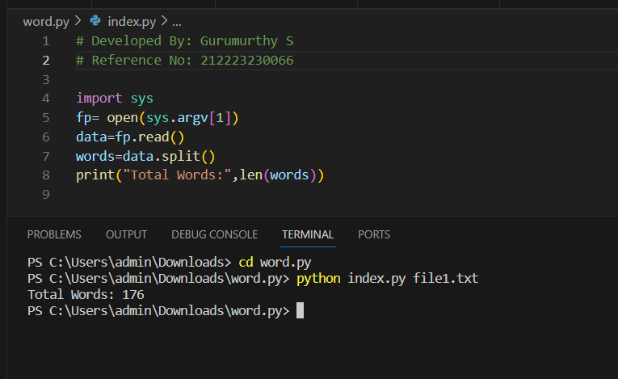
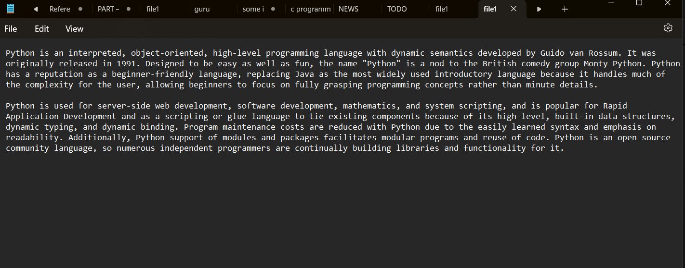

# command-line-arguments-to-count-word
# AIM:
To write a python program for getting the word count from the contents of a file using command line arguments.

# EQUIPEMENT'S REQUIRED:
PC Anaconda - Python 3.7

# AIM:
To write a python program for getting the word count from the contents of a file using command line arguments.

# EQUIPEMENT'S REQUIRED:
PC Anaconda - Python 3.7

# ALGORITHM:
Step 1:
Import the sys module.

Step 2:
Pass the filename as the first argument after the name of script. Open the file as sys.argv[1]

Step 3:
Read the file using read() method.

Step 4:
Use split() method to split the file content into words.

Step 5:
Use len() to find the total words.

# PROGRAM:
```python
# Developed By: Gurumurthy S
# Reference No: 212223230066

import sys
fp= open(sys.argv[1])
data=fp.read()
words=data.split()
print("Total Words:",len(words))

```
# OUTPUT:



Text file



# RESULT:
Thus the program is written to find the word count from the contents of a file using command line arguments.